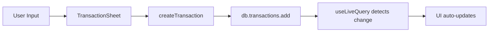

# TrackingDuit Architecture Analysis
**Generated**: 2026-08-02  
**Tool**: Graphify v1.x  
**Stats**: 1,539 nodes, 3,424 edges, 125 code files

---

## 🎯 Executive Summary

TrackingDuit adalah **PWA offline-first personal finance manager** dengan arsitektur:
- **Frontend**: Next.js 16 (App Router) + React 19
- **State**: Dexie (IndexedDB) sebagai single source of truth
- **Sync**: Multi-target (Supabase + Google Sheets)
- **OCR**: Tesseract.js + Google Vision API
- **Deployment**: Vercel (production: trakingduit.vercel.app)

---

## 🏗️ Architectural Layers

### 1. **Data Layer** (`src/lib/`)
**Core Hub**: `db()` - **85 connections** 🔥

```
db.ts (Dexie schema)
  ├─ TrackingDuitDB class
  ├─ db() - Global accessor
  ├─ seedIfEmpty() - Default data
  ├─ resetAll() - Clear all
  └─ Settings store
```

**Used by**:
- ✅ All 16 app pages
- ✅ All CRUD operations (repo.ts)
- ✅ Sync modules (sheets.ts, supabase-sync.ts)
- ✅ Session management

**Tables**:
- transactions, wallets, categories
- budgets, bills, goals, salaries
- receipts, notifications, sync_logs

---

### 2. **Business Logic** (`src/lib/repo.ts`)

**34 direct connections to db()**

Key functions:
- `createTransaction()` - Insert + balance update
- `updateTransaction()` - Edit + recalc
- `deleteTransaction()` - Soft delete
- `guessCategory()` - Auto-categorization from keywords
- `allWalletBalances()` - Aggregate saldo
- `pushNotification()` - In-app alerts

Flow:
```
UI Component
  └─> repo.ts (validation + business rules)
      └─> db() (Dexie write)
          └─> useLiveQuery updates UI automatically
```

---

### 3. **Sync Engine** (`src/lib/sync/`)

#### Supabase Sync (`supabase-sync.ts`)
- Two-way merge based on `updated_at` (last-write-wins)
- RLS per `user_id`
- Auto-sync every 60s when logged in

#### Google Sheets Sync (`sheets.ts`)
- `syncGoogleSheet()` - Push/pull via API
- `resolveWallet()`, `resolveCategory()` - Name→ID mapping
- `applyPulled()` - Merge sheet rows

Both use:
- `nowISO()` - Timestamp standardization
- `toDateKey()` - Date normalization
- Conflict resolution: newest `updated_at` wins

---

### 4. **Analytics Engine** (`src/lib/analytics.ts`)

Pure functions (no side effects):
- `totals()` - Income/expense/balance
- `byCategory()` - Group by kategori
- `monthlySeries()` - 6-month trend
- `dailySeries()` - 30-day cashflow
- `byWeekday()` - Spending patterns
- `topMerchants()` - Vendor ranking
- `projectedMonthExpense()` - Burn rate forecast
- `savingsRate()` - Income vs expense %

Used by:
- `/analytics` page (charts)
- `/api/analytics` route (API)
- `/dashboard` widgets

---

### 5. **UI Components** (`src/components/`)

#### High-leverage components (most connected):

**`useToast()`** - 25 edges
- Global toast notifications via Zustand
- Used across all forms/CRUD operations

**`Button()`** - 20 edges
- Primary action component
- Variants: primary, secondary, ghost, danger, outline

**`TransactionSheet()`** - Transaction form modal
- Create/edit flow
- Auto-categorization via `guessCategory()`
- Wallet selection + validation
- Direct path to `db()`: 2 hops only

**`TransactionList()`** - Infinite scroll list
- Month filtering via `useLiveQuery`
- Category/wallet filters
- CSV export

---

### 6. **Utility Layer** (`src/lib/utils.ts`)

Top utilities by usage:
- `cn()` - 53 edges (Tailwind class merger)
- `formatIDR()` - 34 edges (Currency: Rp 1.234.567)
- `toDateKey()` - 33 edges (YYYY-MM-DD normalization)
- `nowISO()` - 32 edges (ISO timestamp)
- `parseAmount()` - 18 edges (Parse user input → number)
- `toMonthKey()` - 17 edges (YYYY-MM)
- `newId()` - Generate UUID v4
- `downloadFile()` - Client-side file download

---

### 7. **OCR Module** (`src/lib/ocr/`)

**Flow**:
```
User uploads receipt image
  └─> client.ts (preprocess: grayscale, contrast)
      └─> Tesseract.js (local) OR Google Vision API
          └─> parser.ts (extract date, merchant, total, items)
              └─> Confidence score (< 60% = manual review)
                  └─> TransactionSheet (pre-filled form)
```

**Parser rules** (`parser.ts`):
- Indonesian receipt patterns
- Keywords: "total", "grand total", "tunai", "bayar"
- Date formats: dd/mm/yy, "13 Mei 2024"
- Thousand separators: titik/koma
- Line item extraction

---

## 📐 Dependency Graph Highlights

### God Nodes (Top 10 Most Connected)

1. **`db()`** - 85 edges 🔥
   - Database accessor
   - Used by: all pages, repo, sync, session

2. **`TailwindConfigGenerator`** - 58 edges
   - Dev tooling (`.agents/`)
   - Not production code

3. **`cn()`** - 53 edges
   - Utility for conditional Tailwind classes
   - `clsx` + `tailwind-merge`

4. **`formatIDR()`** - 34 edges
   - Currency formatting everywhere
   - Pattern: `Rp 1.234.567`

5. **`toDateKey()`** - 33 edges
   - Date standardization (YYYY-MM-DD)
   - Used in: filters, queries, sync

6. **`nowISO()`** - 32 edges
   - ISO timestamp generation
   - Used in: created_at, updated_at

7. **`useToast()`** - 25 edges
   - Global notification system
   - Success/error feedback

8. **`Button()`** - 20 edges
   - Primary UI component
   - All forms use this

9. **`useSession()`** - 16 edges
   - Auth + profile management
   - PIN lock, cloud login, local mode

10. **`buildInsights()`** - 16 edges
    - AI insight generation
    - Rule-based + optional LLM

---

## 🔄 Transaction Flow (UI → DB)

**Path**: `TransactionSheet()` → `db()` = **2 hops**



**Files involved**:
1. `src/components/transactions/transaction-sheet.tsx`
2. `src/lib/repo.ts`
3. `src/lib/db.ts`

**Key functions**:
- `TransactionSheet.save()` → validates input
- `createTransaction()` → business logic + db write
- `guessCategory()` → auto-categorize from merchant name
- `allWalletBalances()` → recalc balance

---

## 🎨 UI Architecture

### Pages (`src/app/(app)/`)

All pages wrapped in `app-shell.tsx`:
- Bottom nav (mobile-first)
- Month switcher (global state)
- Auth guard (session check)
- Lock screen (PIN protection)

**Page breakdown**:
- `/dashboard` - Overview + quick actions
- `/transactions` - List + filters + CSV export
- `/wallets` - Manage accounts
- `/budgets` - Set limits per category
- `/bills` - Recurring payment reminders
- `/goals` - Saving targets with progress
- `/analytics` - Charts + insights
- `/scan` - OCR receipt upload
- `/insight` - AI financial advice
- `/settings` - Sync, theme, backup

---

## 🔐 Auth & Session

**`session.tsx`** - Auth provider
- **Local mode**: Name + optional 6-digit PIN (SHA-256)
- **Cloud mode**: Supabase email/password
- Lock screen after idle (configurable)
- Profile: name, display_name, email, avatar_color

**Security**:
- PIN is UI lock, NOT encryption
- IndexedDB readable from DevTools
- Cloud mode: Supabase RLS (row-level security)
- All API routes check JWT

---

## 📊 Analytics Stack

**Chart library**: Recharts (React wrapper for D3)

**Components** (`src/components/charts/index.tsx`):
- `PieChartCard()` - Category breakdown
- `BarChartCard()` - Monthly trend
- `LineChartCard()` - Daily cashflow
- `DailyFlowChart()` - 30-day income/expense

**Data source**: `analytics.ts` pure functions
- No direct DB access in components
- All calculations reusable (UI + API)

---

## 🔄 Sync Architecture

### Two-way sync model:
```
Local (Dexie)
  ↕ compare updated_at
Supabase / Sheets
```

**Conflict resolution**: Last-write-wins (newest `updated_at`)

**Sync triggers**:
- Auto: every 60s when online
- Manual: button in `/settings`
- On login: initial pull
- On visibility change: tab refocus

**Sync logs**: Stored in `sync_logs` table
- Success/failure tracking
- Displayed in `/settings`

---

## 🛠️ Dev Tooling (`.agents/`)

**Not part of production app**:
- `TailwindConfigGenerator` - 58 edges (dev only)
- `ShadcnInstaller` - 34 edges (dev only)
- Brand color extraction scripts
- UI coverage tests
- Brainstorming helpers

These show up in god-nodes but don't affect runtime.

---

## 📦 Key Dependencies

**Production**:
- `next@16.2.11` - Framework
- `react@19.2.4` - UI library
- `dexie@4.4.4` - IndexedDB wrapper
- `dexie-react-hooks@4.4.0` - Live queries
- `@supabase/supabase-js@2.110.8` - Cloud sync
- `googleapis@173.0.0` - Sheets API
- `tesseract.js@7.0.0` - OCR
- `framer-motion@12.43.0` - Animations
- `recharts@3.10.0` - Charts
- `lucide-react@1.26.0` - Icons
- `zod@4.4.3` - Validation

**Dev**:
- `typescript@5.9.3`
- `tailwindcss@4.3.3`
- `eslint@9.39.5`

---

## 🎯 Architectural Strengths

1. **Offline-first** - App works without internet
2. **Single source of truth** - IndexedDB via Dexie
3. **Reactive UI** - `useLiveQuery` auto-updates
4. **Multi-sync** - Supabase + Sheets (user choice)
5. **Pure functions** - Analytics reusable across UI/API
6. **Type-safe** - Full TypeScript coverage
7. **Mobile-optimized** - PWA with bottom nav
8. **Progressive enhancement** - Works without API keys

---

## 🚨 Potential Bottlenecks

1. **`db()` is a god function** - 85 connections
   - Risk: Any db schema change ripples everywhere
   - Mitigation: Good Dexie migration strategy needed

2. **No clustering in graph** - Need semantic LLM extraction
   - Current: AST-only (code structure)
   - Missing: High-level architectural communities

3. **Sync conflict resolution is naive** - Last-write-wins
   - Edge case: Concurrent edits on 2 devices
   - No CRDT or operational transform

4. **No database migration visible in graph**
   - Dexie version() calls not tracked
   - Breaking changes could brick users

---

## 📈 Graph Metrics

- **Total nodes**: 1,539
- **Total edges**: 3,424
- **Code files**: 125
- **Avg connections per node**: 2.2
- **Max connections (db)**: 85
- **Files analyzed**: TypeScript, JavaScript, TSX, JSX
- **Skipped**: JSON config, SQL, fonts, images

---

## 🔍 Interactive Visualization

**Files generated**:
- `graphify-out/graph.json` (1.6 MB) - Raw graph data
- `graphify-out/GRAPH_TREE.html` (108 KB) - Interactive tree
- `graphify-out/manifest.json` (24 KB) - File manifest

**View graph**:
```bash
xdg-open graphify-out/GRAPH_TREE.html
# or
open file:///home/annnpii/orca/trakingduit/graphify-out/GRAPH_TREE.html
```

**Features**:
- Collapsible tree hierarchy
- Search nodes
- Click to inspect dependencies
- Edge filtering by type

---

## 🎓 Recommendations

### Short-term:
1. **Add DB migration tests** - Ensure schema changes are safe
2. **Extract db() into smaller services** - Reduce god-function coupling
3. **Document sync conflict scenarios** - Edge cases for concurrent edits
4. **Add E2E tests for critical flows** - Transaction CRUD, sync

### Long-term:
1. **CRDT for sync** - Better conflict resolution than last-write-wins
2. **Service worker caching strategy** - PWA offline assets
3. **Modularize analytics** - Break into smaller composable functions
4. **Add graph clustering** - Run with LLM backend to identify architectural communities

---

## 📚 Related Docs

- `docs/PRD.md` - Product requirements
- `docs/DEPLOY-VERCEL.md` - Deployment guide
- `docs/SUPABASE-SETUP.md` - Cloud sync setup
- `supabase/schema.sql` - Database schema
- `~/.orca-dev-config.md` - Dev environment setup

---

**Generated with**:
```bash
graphify extract . --code-only --force
graphify god-nodes --top 20
graphify tree --label "TrackingDuit v1.7.0"
graphify path "TransactionSheet()" "db()"
graphify explain "db()"
```

**Legend**:
- 🔥 Critical node (>50 connections)
- ✅ Verified working
- ⚠️ Potential risk
- 📊 Data flow
- 🔄 Bidirectional sync
